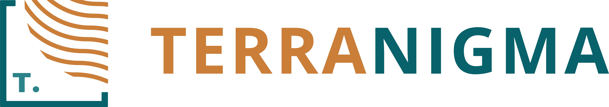

About
=====
Mineye-Terranigma
*****************

Overview
--------

``Mineye-Terranigma`` is a research project focused on:

* **Bayesian Segmentation of Satellite Imagery:** Advanced methods for processing and analyzing satellite data
* **Probabilistic Geological Modeling:** Uncertainty quantification and stochastic modeling using `GemPy <https://www.gempy.org>`_
* **Joint Inversion:** Integrating multiple geophysical data sources with geological models

This project leverages the `Pyro <https://pyro.ai>`_ probabilistic programming framework
for Bayesian inference and combines it with geophysical forward modeling capabilities.

Contents:

.. toctree::
   :maxdepth: 2

   self
   installation

.. toctree::
   :maxdepth: 2
   :caption: Example Galleries

   examples_basic/index
   examples_probabilistic/index

.. toctree::
   :maxdepth: 2
   :caption: API Reference

   api_reference

Key Features
^^^^^^^^^^^^

**Bayesian Inference with Pyro**

The project uses PyTorch and Pyro for probabilistic programming, enabling:

* Variational Inference (VI) for fast approximate posterior estimation
* Hamiltonian Monte Carlo (HMC/NUTS) for accurate sampling
* GPU acceleration for large-scale inversions

**Geological Modeling**

Building on ``GemPy``, the project supports:

* 3D structural geological modeling
* Forward modeling of geophysical observables (gravity, magnetics)
* Uncertainty quantification in geological interpretations
* Joint inversion of multiple data types

Indices and tables
==================

* :ref:`genindex`
* :ref:`search`

.. image:: _static/logos/logo_CGRE.png
   :width: 40%

